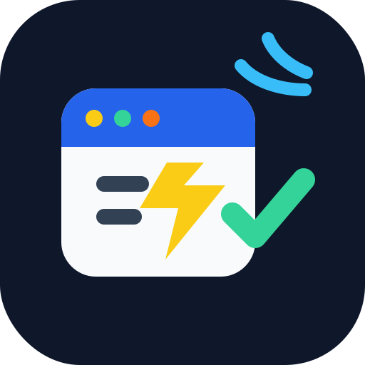
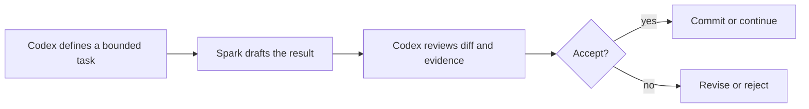

<p align="center">
  
</p>

<h1 align="center">codex-spark-playbook</h1>

<p align="center">
  <strong>把 codex-5.3-Spark 当成快速、可审计的小任务执行通道，而不是最终决策者。</strong>
</p>

<p align="center">
  <a href="./SKILL.md">Skill</a>
  ·
  <a href="./skills/cxspark/SKILL.md">cxspark</a>
  ·
  <a href="./prompts/spark-bounded-task.md">Bounded Task Prompt</a>
  ·
  <a href="./docs/workflow.md">Workflow</a>
  ·
  <a href="./docs/limitations.md">Limitations</a>
  ·
  <a href="./docs/examples.md">Examples</a>
</p>

<p align="center">
  
  
  
  
</p>

> This is not an unlimited quota claim. It is a practical workflow based on current account UI observations: Spark appears to be counted separately from 5.4 / 5.5 usage, and it is useful when the task is narrow enough for Codex to review afterward.

## What It Solves

High-value model context should not be spent on every small implementation detail. This playbook gives you a repeatable way to delegate narrow non-multimodal tasks to Spark, then bring the output back to the current Codex session for review.

| Use Spark For | Keep In Codex |
| --- | --- |
| Small patches with exact file scope | Final acceptance and release decisions |
| Prompt, README, docs, test, and checklist drafts | Secrets, publishing, deletion, migrations |
| Single-file or few-file mechanical edits | Real device, emulator, simulator, or browser QA |
| Local refactors with reviewable diffs | Multimodal work such as images, videos, screenshots, and visual UI judgment |
| Second-pass analysis when main quota is tight | Ambiguous product direction or large redesigns |

## 30-Second Workflow



The rule is simple:

```text
Codex writes the bounded task detail.
Spark drafts the result.
Codex reviews the diff, evidence, token usage report, and tests.
Only Codex accepts or rejects the result.
```

## Quick Start

1. Open [`SKILL.md`](./SKILL.md), [`skills/cxspark/SKILL.md`](./skills/cxspark/SKILL.md), or [`prompts/spark-bounded-task.md`](./prompts/spark-bounded-task.md).
2. Replace the task, allowed files, behavior limits, forbidden actions, checks, and risks.
3. Keep the context small and sanitized.
4. Ask Spark for summary, touched files, verification, risks, assumptions, and a Spark Usage Report.
5. If runtime token usage is unavailable, require `token_usage_unavailable`; never estimate token numbers.
6. Review the result in the current Codex session before accepting anything.

## cxspark Shortcut

`cxspark` is the portable shortcut skill for this playbook. It means "Codex Spark": a fixed work role for small, bounded, non-multimodal tasks. The runtime may assign a temporary worker name each time, but the role boundary stays the same: Spark drafts, parent Codex reviews and accepts.

## Safety Boundaries

- Do not pass secrets, tokens, cookies, private account files, or raw credential logs.
- Do not ask Spark to publish, delete, push, migrate, or perform irreversible actions.
- Do not use Spark for image, screenshot, video, visual UI, or diagram interpretation.
- Do not use Spark for real device, emulator, simulator, browser, or app-interaction QA.
- Do not describe Spark as free, unlimited, official, or guaranteed to bypass quota limits.
- Do not invent token usage. Report exact usage only when the runtime exposes it.

## Repository Map

| Path | Purpose |
| --- | --- |
| [`SKILL.md`](./SKILL.md) | Installable Codex skill entrypoint |
| [`skills/cxspark/SKILL.md`](./skills/cxspark/SKILL.md) | Shortcut installable skill for the fixed `cxspark` bounded-worker role |
| [`skills/cxspark/agents/openai.yaml`](./skills/cxspark/agents/openai.yaml) | Optional UI metadata for the `cxspark` role |
| [`prompts/spark-bounded-task.md`](./prompts/spark-bounded-task.md) | Default delegation prompt for small reviewable tasks |
| [`docs/workflow.md`](./docs/workflow.md) | Step-by-step operating workflow |
| [`docs/limitations.md`](./docs/limitations.md) | Quota wording, multimodal limits, and public safety notes |
| [`docs/examples.md`](./docs/examples.md) | Good and bad delegation examples |

## When This Is Worth Using

Use this playbook when you already know the next step and want a fast draft. Avoid it when the problem is still unclear, visual, sensitive, device-dependent, or release-critical.

Spark is useful for throughput and for saving parent-session context. Codex remains responsible for correctness.
